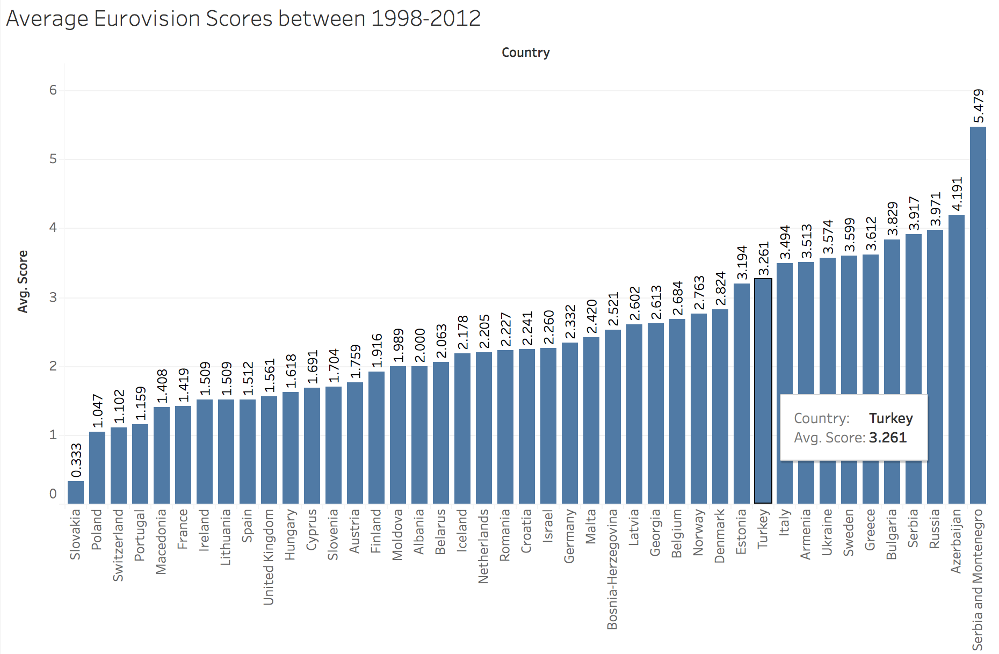
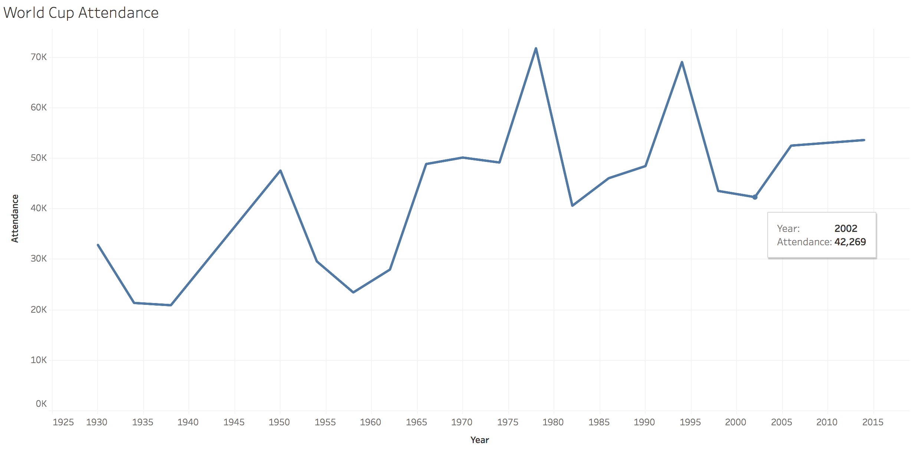
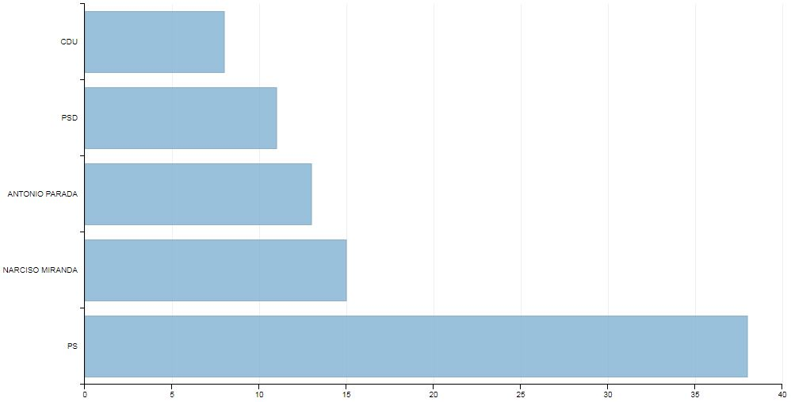
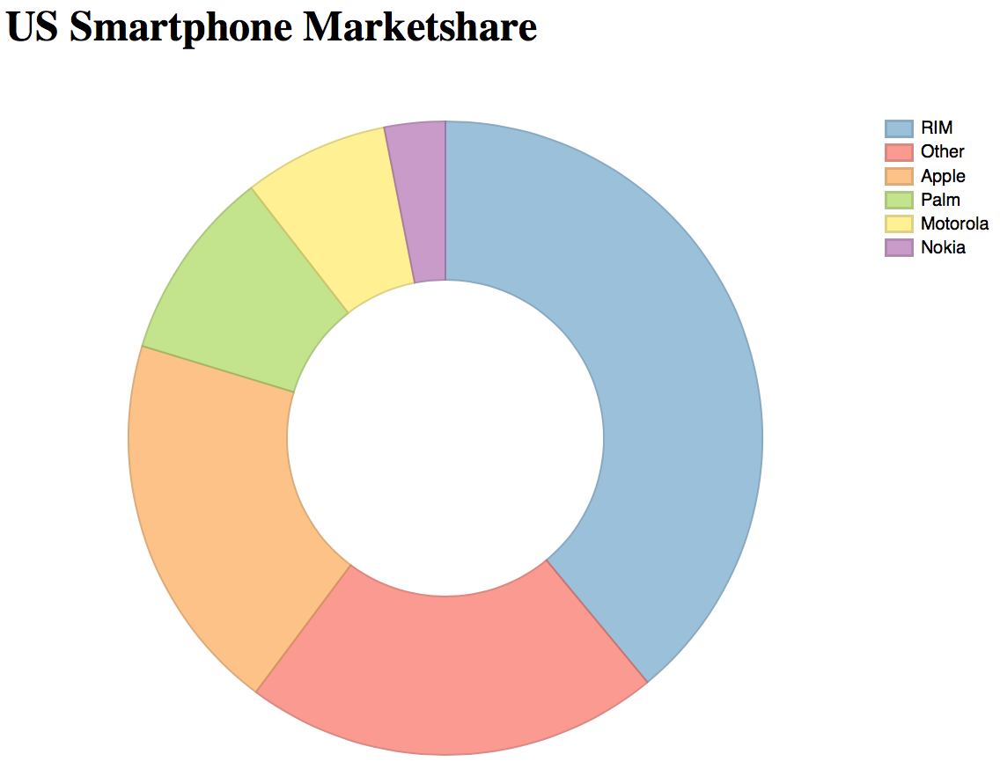
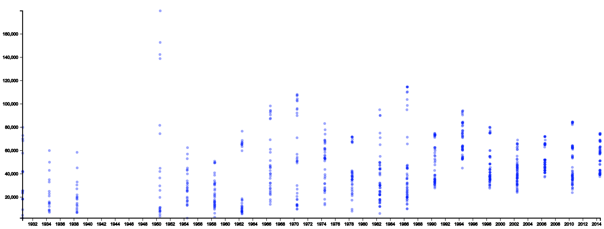

# Udacity Data Visualization

**MINI PROJECTS**

***

**Raw Visualizations**

[Link](https://public.tableau.com/profile/alpers#!/vizhome/EurovisionAverageScores/Sheet1)

[Link](https://public.tableau.com/profile/alpers#!/vizhome/WorldCupAttendance_0/WorldCupAttendance)

***

**Visualization Makeover**

| Original | Fixed |
|:-------------------------:|:-------------------------:|
| | |
[Image source](https://www.rtp.pt/noticias/autarquicas2017/sondagem-ps-a-beira-da-maioria-absoluta-em-matosinhos_n1029426)|[Implementation](Visualization%20Makeover/index.html)

***

**Alternatives to Pie Chart**

| Original | Fixed |
|:-------------------------:|:-------------------------:|
| | |
[Image source](https://theanalyticsstore.ie/12-days-data-analytics-day-4-show-data-data/)|[Implementation](Alternative%20to%20Pie%20Chart/index.html)

***

**World Cup Home Games**

*Capitalization-globalization in time

| Original | Fixed |
|:-------------------------:|:-------------------------:|
| | |
[Old](World%20Cup%20Home%20Games/old.html)|[New](World%20Cup%20Home%20Games/index.html)

***

**Final - Globe World Cup**

*Interactive Map

Martini Glass Structure (Author Driven and Reader Driven)

| Original |
|:-------------------------:|
| | |
[Code](Final%20-%20Globe%20World%20Cup/index.html)|

***

completed on 25/12/2017